# Renode emulation of the 2008 Tesla Roadster VMS

Copyright (c) 2024 [Antmicro](https://www.antmicro.com)

## Background

Recently, Tesla released a large package of documentation and software related to the 2008-2012 Roadster. This release contained, among other things, schematics and firmware for the VDS (Vehicle Display System) and firmware for the VMS (Vehicle Management System). We decided to see if we could get the VMS firmware running in [Renode](https://renode.io), our open-source emulation framework. The answer is, of course, yes!

## Repository contents

* `src/CANDecoder.cs`: decodes CAN messages transmitted by the VMS firmware
* `flash.bin`: contains `firmware.rc` extracted from `vehicle-firmware-5.2.0.43` as well as an empty `vms.cfg`, which are required by the VMS firmware to run
* `README.md`: the file you're reading now
* `roadster_release`: submodule pointing to https://github.com/teslamotors/roadster
* `roadster.resc`: Renode script that runs the Roadster VMS firmware
* `roadster.robot`: Renode test to verify CAN message sending and parsing

## Running locally

To follow these steps, you need a recent version of Renode installed. Refer to [the installation guide in Renode's README](https://github.com/renode/renode/blob/master/README.rst#installation), or use [renode-run](https://github.com/antmicro/renode-run).

### Getting this repo and the Roadster firmware

This repository contains everything you need to run the demo in Renode, including the original [teslamotors/roadster](https://github.com/teslamotors/roadster) repository as a submodule (in [`roadster_release`](./roadster_release)) which in turn contains a copy of the [Roadster diagnostic disc image](https://github.com/teslamotors/roadster/blob/b71b47cd3c82ad58e1aefb770d9489c7c0e94980/Diagnostic%20Software/Roadster%20All%20Rev%2013.05.21.iso).

To be able to get the `.iso` file, [you need to make sure you have GitLFS set up](https://github.com/git-lfs/git-lfs#installing).

With Git LFS installed, clone this repository using:

```
git clone --recursive https://github.com/antmicro/renode-tesla-roadster-simulation.git

```

If you don't have Git LFS or want to download the diagnostic disc image manually, you can do that using:

```
wget https://github.com/teslamotors/roadster/raw/b71b47cd3c82ad58e1aefb770d9489c7c0e94980/Diagnostic%20Software/Roadster%20All%20Rev%2013.05.21.iso
```

In this case you need to adjust the path in the first `bsdtar` invocation below to point to your downloaded file.

Now, extract the firmware files from the image. If you have `bsdtar` installed (available in the `libarchive-tools` package on Debian and derivatives), all you need to do is:

```
bsdtar xf "roadster_release/Diagnostic Software/Roadster All Rev 13.05.21.iso" Roadster-5.2.0.zip
bsdtar xf Roadster-5.2.0.zip --strip-components=2 roadster-5.2.0/vehicle-firmware-5.2.0.43/{firmware.rc,linux.bin,vms.image}
```

You can use your preferred software to extract these files instead - the important point is that at the end you should end up with 3 additional files in the root of the repository: `firmware.rc`, `linux.bin` and `vms.image`.

### Interactively running the VMS firmware

To run the VMS firmware interactively, execute:

```
renode roadster.resc
```

You will see the Renode Monitor, as well as an analyzer window displaying the CAN boot message console. Note that once the `vms` binary starts you will not be able to interact with the console. The following recording demonstrates this (note that the GUI is disabled, so the Monitor and UART output both appear in the shell):



### Running Robot tests for the VMS

To run the Robot test which verifies decoding of the CAN messages transmitted by the VMS firmware, execute:

```
renode-test roadster.robot
```

You can use the `--show-log` option to view the output in real time and see the decoded CAN messages as they come in (the following output is an abridged example):

```
$ renode-test --show-log roadster.robot
+++++ Starting test 'roadster.Should Run VMS Original Image'
11:57:32.1043 [INFO] Roadster: Machine started.
11:57:32.1766 [INFO] canuart: [host: 0.3s (+0.3s)|virt: 6ms (+6ms)] Linux version 2.6.11.8-2.6.0 (build@roadster-build) (gcc version 3.4.3) #1 Mon Mar 22 10:18:07 PDT 2021
11:57:32.1783 [INFO] canuart: [host: 0.3s (+1.76ms)|virt: 6.1ms (+0.1ms)] CPU: Philips-LPC2294 [fff00000] (ARMv3)
11:57:32.1783 [INFO] canuart: [host: 0.3s (+56.6µs)|virt:    6.1ms (+0s)] Machine: LPC2294
11:57:32.1787 [INFO] canuart: [host: 0.3s (+80.1µs)|virt:    6.1ms (+0s)] Kernel command line: panic=5 console=can3 initrd=yes
11:57:38.8883 [INFO] canuart: [host:   7.01s (+1.18s)|virt:  5.77s (+0.62s)] VMS: VMS restarted - version 15.6.0
11:57:42.4940 [INFO] decoder: BSM request: Clear Non-perm Faults
11:57:42.4941 [INFO] decoder: BSM request: Clear All Faults
+++++ Finished test 'roadster.Should Run VMS Original Image' in 18.57 seconds with status OK
```
